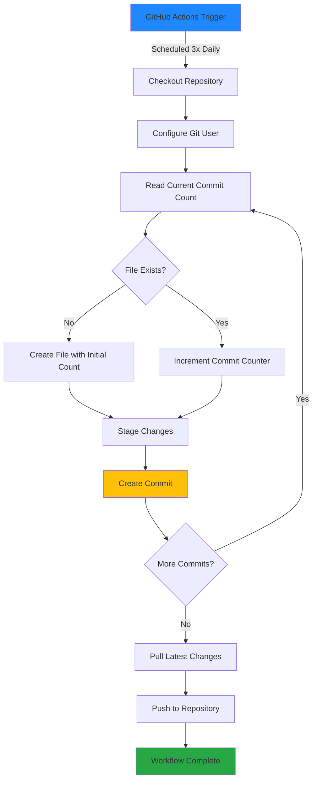
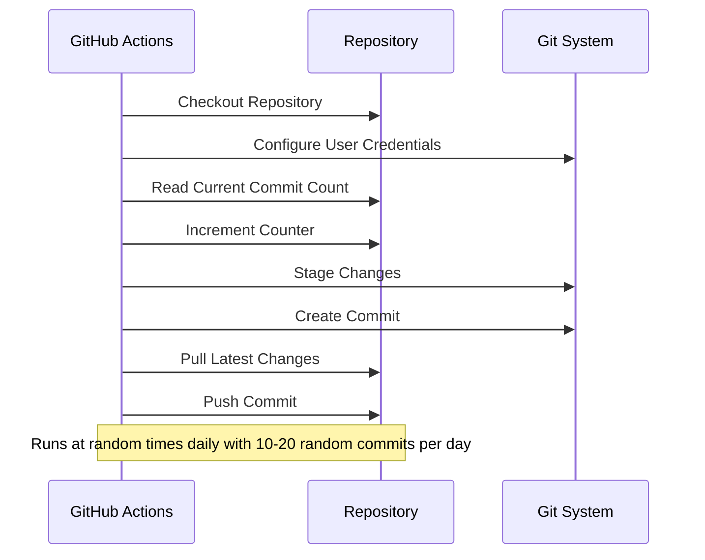

# GitAuto - Automated Git Commit Workflow

> An automated GitHub Actions workflow that maintains consistent commit activity by automatically updating and committing changes to your repository.

## 📋 Overview

GitAuto is a GitHub Actions-based automation tool designed to maintain regular Git commit activity. The workflow runs on a scheduled basis and automatically updates tracked files, increments commit counters, and pushes changes to your repository.

## 📈 Statistics

commit number: 152

## 🎯 Features

- **Randomized Scheduling**: Multiple random execution times throughout the day for natural activity patterns
- **Variable Commit Count**: Random commits between 10-20 per day (e.g., 13 one day, 10 the next, 15 another day)
- **Intelligent Commit Tracking**: Automatic increment of commit counters
- **GitHub Actions Integration**: Seamless CI/CD workflow automation
- **Natural Timing**: Random delays between commits to simulate human-like activity
- **Professional Commit Messages**: Structured and descriptive commit messages

## 🔄 Workflow Architecture



## 📊 Workflow Execution Flow



## 🚀 Quick Start

1. **Fork or Clone** this repository
2. **Customize** the workflow file if needed
3. **Commit and Push** the workflow file
4. The automation will start on the next scheduled run

## 📝 Commit Structure

Each automated commit follows this pattern:
```
Auto commit #<number> : target - (<filename>)
```

## 🛠️ Technology Stack

- **GitHub Actions**: Workflow automation
- **Bash Scripting**: Commit logic execution
- **Git**: Version control operations

## 🤝 Contributing

Feel free to fork this repository and adapt it to your needs. Suggestions and improvements are welcome!

---

**Note**: This tool is designed for maintaining commit activity streaks and demonstrating CI/CD automation concepts. Use responsibly and in accordance with GitHub's terms of service.
